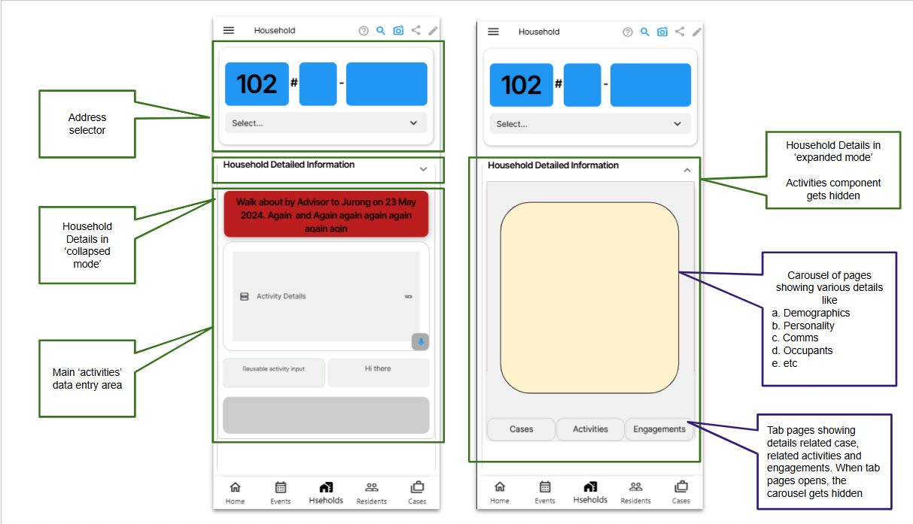
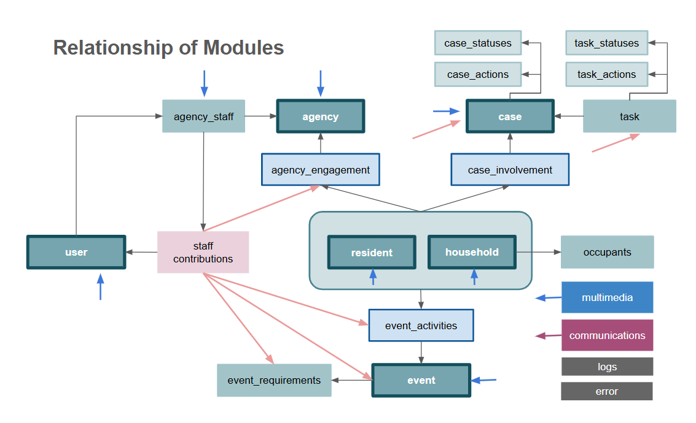

# Requirements for Engaged Community application

## Purpose

Engaged Community System (ECS) is a SAAS targeting at organisations that serves the Community. The Community includes Organisations, Agencies and Volunteers (3 IN 1). Organisation could include (1) elected officials (individuals) who are responsible for their electoral boundaries or (2) entities that serve specific segments of the community such as a social welfare organisation. An Organisation could decide to be a partner organisation within a SAAS instance instead of owning or managing their own instance. The Organisation that owns the SAAS instance is known as the 'host' organisation. The Partner is known as the 'partner' organisation. Agencies are organisations that work also in the community. They are not users of the ECS but information is recorded and registered for purposes of collaborating between organisations and agencies. Users of the system members of Organisations and Agencies. An organisation is also an agency for the purpose of managing users and defining their rights. The Volunteer can be individual or a group of individuals who are then members of a volunteer agency.

### Target Audience of ECS users

These organisations, in common, have 2 main target audience
1. Households and Residents being one category
   1. Households can be residential households or business entities that have physical addresses; and/or
   2. Residents can be residents of a local community or any other persons living in or without the community or area.
2. Volunteers who are the main users of the system. Management of organisations will need volunteers to engagement the community and so the proper management of volunteers will be key to a successful use of the application.

### ECS users

The users of the system are
1. staff of the 'host' and partner organisation
2. volunteers that work for these organisations
3. management of organisations whose role includes 'mgmt' and 'administrators'
   
The main use of the app for most users are
1. manage events to engage the households or residents;
2. manage cases which are feedbacks or issues that need to be dealt with

Other modules that are for specific users such as administrators
1. Case Management enhanced features which include
   a. Tasking and case tracking
   b. Communication with household and residents to close the loop
2. Volunteer Management
3. Dashboards and Analytics
4. Campaign management

## ECS Implementation Phases

ECS will be built over 3 phases
1. Phase 1 - Create
   Create phase focus is on allowing users to enter information to create data.
2. Phase 2 - Productive
   Productive phase focus is on automation and enhancing communication between users and customers.
3. Phase 3 - Manage
   Manage phase focus on using AI tools and to manage at a more strategic level.

## ECS Platforms

There will 2 platforms
1. a mobile app platform that caters to mobile phones and tablets. Very specifically for both Android and iOS platforms. For phase 1 implementation needs to take it to the deployment of apps to both Android Play Store and iOS Store.
2. a web based app that has similar UI to the mobile app but adapted to the desktop environment

### ECS Modules Requirements

 
#### Homepage (Corporate Page)

Purpose :
The purpose of the `Homepage` module is to
1. serves as main landing page for the mobile module
2. allow update of content at the Homepage to provide user with the latest info
3. Consist of info "About Us Page", "Our Partners", "Contact Us"- EMail to relevant Staff, Add to Feedback Module

Requirements of the `Homepage` module
1. Listing on "latest News"
2. Ability to show updated "News"
3. Ability to show related Volunteering Opportunities ie `event`.
   1. see related `agency` / `user` who are participating in `event`
   2. see 'likes', no of views for the `event`
   3. Ability to share News and Volunteering Opportunities with friends
4. Listing of of these Volunteering Opportunities `event` based on user preferences, age, interest (Types of causes) , length of volunteering period
5.  Ability to see summary of `user` `contributions`
    1.  `event`
    2.  `event_activity`
    3.  `event_requirement`
    4.  `case`
    5.  `case_task`
    6.  `engagement`
6.  Ability to view the general
   - Privacy Policy
   - Terms & Conditions
   - Contact Us

Phase 2 requirements :
1. Send notifications to users in the home page.

 
#### Household Module

Purpose :
The purpose of the `household` module is to
1. facilitate `household` visit;
2. update information abt the `household`;
3. capture activity conducted with the `household` as `activity`;
4. record their feedback and complaints as `case`

Requirements of the `household` module
1. Ability to select the household thru interactive `household` selector
2. Ability to see basic information abt the household
3. Ability to see the following engagement information with the household
   1. Past and current `case` related to the household
   2. Past `activity` with the household
   3. Past and current `outreach` with the household

> NB :
> `case` - case has a module by itself. It captures all feedback and complaints submitted by households. Case will be further processed into `task` and tracked. The details of `case` module will be provided further below.
> `activity` is not a module but a record of an activity with a household or resident eg a simple household visit, delivery of food, pamphlets etc.
> `outreach` is

UI Mobile app requirement:

The `household` module can be organised into 3 different parts
1. An address selector that shows which unit is being process.
   1. Users select the street, and the relevant blocks on that street shows up starting with the lowest number as a default
   2. Users swipe the block up and down to select the right block
   3. Once the block is selected, level 1 or the next level is presented as a default.
   4. Users swipe the floor up and down to select the right floor
   5. Once the floor is selected, the a default unit is presented as a default.
   6. Users swipe the unit up and down to select the right unit.
   7. Current version does not allow keying in of address but via the above method only.
2. Household details which is presented in a series of cards organised in a carousel manner
   1. Address Details
   2. Demographics
   3. Comms
   4. Character
   5. Occupants
   6. Multimedia
   7. A bottom tab page which shows
      1. Case page which list all the cases associated with this household
      2. Activity page which list all activities with this household.
      3. outreach page which list all outreach provided to this household
3. An activity segment which focuses on adding in `activity` with this household. This is typically done during house visit. This dedicated segment enhances the ease of keying in information.

Below is a visual of how the  UI might look like

UI Web app requirement :
1. The web based UI is not meant for all users as it is more for administrating.
2. Check `functionalRights` for 'hhWeb' before allowing web based view
3. Ability to provide overview of all households, 
   1. basic graphical view on activities relating to households eg on of creation of records, updates to records, no of users upating the records based on timeline of daily, weekly, monthly, over a selected period of time   
4. Ability to select specific household and update information easily based on the web UI
5. Ability to bulk update records with filters and confirmation of action before proceeding

Phase 2 requirements :
1. Households detailed analysis via the `dashboard` module
2. Error handling - Provide meaningful error messages and prevent submission if requirements are not met.
3. Data Validation- Configurable validation and duplicate alerting
4. Communication - Integration with Whatsapp/email to allow message to send out to the household
5. Track and manage historical resident data

Phase 3 requirements :
1. AI transcribing of voice recording and summarising the details into `activity`
2. AI analysis of sentiments of households and to recommend and create `campaign` for households engagements

Information to be captured
1. See household_schema.md for details

 
#### Resident Module

Purpose :
The purpose of the `resident` module is to
1. facilitate engagement with a `resident` in any situation;
2. create a record of a `resident`;
3. update information abt the `resident`;
4. capture activity conducted with the `resident` as `activity`;
5. record their feedback and complaints as `case`

Requirements of the `resident` module
1. Ability to select the `resident` thru basic search
2. Ability to see basic information abt the `resident`
3. Ability to see the following engagement information with the `resident`
   1. Past and current `case` related to the resident
   2. Past `activity` with the resident
   3. Past and current `outreach` with the resident
4. It should enable easy capture of specific information, live recording of audio, video, images etc including the uploading of multimedia from phone galleries.
5. Each interaction will be recorded as an `activity` which will be recorded and tied to the `resident` for future reference
6. `resident` feedback or complaints will be recorded as `case` for further processing.

UI Mobile app requirement :
1. When used on a mobile phone or tablet, the focus of the UI is for capturing of data.
2. The selection of resident should be easy thru a search function.

UI Web app requirement :
1. The web based UI is not meant for all users as it is more for administrating.
2. Check `functionalRights` for 'residentWeb' before allowing web based view
3. Ability to provide overview of all residents, 
   1. basic graphical view on activities relating to residentss eg on of creation of records, updates to records, no of users upating the records based on timeline of daily, weekly, monthly, over a selected period of time   
4. Ability to select specific resident and update information easily based on the web UI
5. Ability to bulk update records with filters and confirmation of action before proceeding

Phase 2 requirements :
1. Residents analysis via the `dashboard` module
2. Error handling - Provide meaningful error messages and prevent submission if requirements are not met.
3. Data Validation- Configurable validation and duplicate alerting
4. Communication - Integration with Whatsapp/email to allow message to send out to the resident
5. Track and manage historical resident data

Phase 3 requirements :
1. AI transcribing of voice recording and summarising the details into `activity`
2. AI analysis of sentiments of residents and to recommend and create `campaign` for residents engagements

Information to be captured
1. See resident_schema.md for details

 
#### Case Module

Purpose :
The purpose of the `case` module is to
1. On the mobile or tablet the information provided is more as a reference for volunteers to understand the `household` or `resident`.
2. record the feedback or complaints of `household` or `resident` on the mobile app.
3. process the `case` on the web app allow user to assign `task` to collaborating `agency`, update status and keying in of relevant information.

Requirements of the `case` module
1. Ability to select the relevant `case` thru basic search
2. Ability to see basic information abt the `case`
3. Ability assign `task` to one or multiple `agency` and/or `user`
4. Ability to see the following related information
   1. breakdown of task
   2. `household` and/or `resident` involved in the case
   3. case status, case officer
5. It should enable easy capture of specific information, live recording of audio, video, images etc including the uploading of multimedia from phone galleries.
6. Status Tracking: Define clear case statuses (New,In Progress, On Hold, Resolved/ Completed, Closed, Reopened).
7. Internal Notes/ Comments: Allow staff to add internal notes/ comments to a case, visible only to staff level.
8. Collaboration: Enable multiple staff/ agencies to collaborate on a single case.

UI Mobile app requirement :
1. When used on a mobile phone or tablet, the focus of the UI is for capturing of data.
2. The selection of resident should be easy thru a search function.

UI Web app requirement :
1. The web based UI is not meant for all users as it is more for administrating.
2. Check `functionalRights` for 'caseWeb' before allowing web based view
3. Ability to provide overview of all cases, 
   1. basic graphical view on activities relating to cases eg on of creation of records, updates to records, no of users upating the records based on timeline of daily, weekly, monthly, over a selected period of time   
4. Ability to select specific case and update information easily based on the web UI
5. Ability to bulk update records with filters and confirmation of action before proceeding
6. Ability to create task for each case, assign task to agencies and update task.
7. Ability to send WA/Email to `agency` to be in phase 2

Phase 2 requirements :
1. ability to project manage `case`
2. ability to send emails to collaborating `agency` with details of cases
3. ability to send email/WA/Telegram to `household` and `resident` on updates or conclusion of cases
4. Ability to automate by indicating the type of agencies to send to
5. Ability to indicate the urgency/ priority of the case
6. Workflow Automation: Automate Status Changes/ Assignments based on certain triggers (e.g. Auto- assign to specific agency based on category)
7. Communication & Notification: Real-time updates - notify users (via push notifications/ Email/ SMS) when there are updates to their cases (Eg: Status Change, new comment from staff)
8. Generate appeal letters automatically with case summary to various government agencies. Able to track these correspondences for follow ups.

Phase 3 requirements :
1. AI based recommendations of tasking based on past task assignments.

Information to be captured
1. See case_schema.md for details

 
#### Event Module

Purpose :
Community activities are largely organised by and participated by volunteers. Volunteers participate in activities through events organised by the 'host' organisation or 'partner' organisations. The purpose of the `event` module is therefore to
1. allow administrator and volunteers to create and manage participation of volunteers in `events`
2. it should be grab attention and drive interest of volunteers to sign up and participate in events
3. it should provide sufficient information to volunteers to encourage them to sign up, reschedule, cancel their participation
4. it should allow organiser to specify requirements for the event, assign collaborating `agency` or volunteer `users`

Requirements of the `event` module
1. A `event` module is able to list all the past, ongoing and future events.
2. Ability to select the relevant `events` thru basic search
3. Ability to see basic information abt the `event`
4. Ability of organiser to specify requirements for the event eg need for photographers, and to assign assign collaborating `agency` or volunteer `user` to the task
5. Ability for `user` to see, join or cancel join the event
6. Organiser able to generate QR code so that `user` coming for the event can sign in via the QR code.
7. Ability to see all `activity` records generated out of the event
8. It should enable easy capture of specific information, live recording of audio, video, images etc including the uploading of multimedia from phone galleries.

UI Mobile app requirement :
1. When used on a mobile phone or tablet, the focus of the UI is for capturing of data.
2. The selection of `event` should be easy thru a search function.

UI Web app requirement :
1. The web based UI is not meant for all users as it is more for administrating.
2. Check `functionalRights` for 'eventWeb' before allowing web based view
3. Ability to provide overview of all events, 
   1. basic graphical view on activities relating to `event` eg on of creation of records, updates to records, no of users upating the records based on timeline of daily, weekly, monthly, over a selected period of time   
4. Ability to select specific event and update information easily based on the web UI
5. Ability to bulk update records with filters and confirmation of action before proceeding
6. Ability to create `requirement` for each event, assign to agencies/users.
7. Ability to see overview of acceptance of `requirement` assignment to `agency` and `user`

Phase 2 requirements :
1. ability to send emails/WA/Telegram to collaborating `agency` and volunteer `users` with details of events
2. ability to analyse `event` via `dashboard` module
3. ability to manage the events on the ground, eg see who has arrived and checked-in, send WA to those who have not arrived to chase them to arrive at event, ability send out mass WA or emails for reminders
4. ability to activate backups or reassign when `user` pulls out of `event`

Phase 3 requirements :
1. AI based recommendations of `event requirement` and recommendation for assigning of collaborating `agency` and `user` to best meet objectives of the event
2. Ability to identify regulatory requirements for certain types of events and to automate the application either thru APIs or email applications or other AI initiated applications to websites
3. Ability to define logistics for event and to recommend and perform procurements etc.
4. Keep track of assets that can be used for event
5. Budget capabilities for events
6. Calendaring capabilities eg shared calendars
7. Location information in division for event planning eg football fields, classrooms for training, carparks, public facilities etc
8. recommendation of events based on public activities thru the use of AI agents
9. ability to receive information from other sources and to create `activity` eg bereavement to send wreaths etc
10. Maintain a calendar of yearly activities where `event`have to be organised

Information to be captured
1. See event_schema.md for details

 
#### Agency Module

Purpose :
A `agency` module is to capture information of a collaborating `agency` including its case officers.
It allows administrators to assign agencies `task` in the `case` module and such task will be tracked.

Requirements of the `agency` module
1. Create basic information abt the agency
2. create `engagement` information

UI Web app requirement :
1. The web based UI is not meant for all users as it is more for administrating.
2. Check `functionalRights` for 'agencyWeb' before allowing web based view
3. Ability to provide overview of all collaborating `agency`, 
   1. basic graphical view on activities relating to `agency` eg no of agencies, no of engagements and filtered based on agencies, on of creation of new agencies, new engagements based on timeline of daily, weekly, monthly, over a selected period of time   
4. Ability to select specific agency and update information easily based on the web UI
5. Ability to bulk update records with filters and confirmation of action before proceeding

Phase 2 requirements :
1. ability to send emails/WA/Telegram to collaborating `agency` and

Phase 3 requirements :
1. ability to plan for `engagement` such as giving out of scholarships etc for `household` and `resident`
2. plan collaboration opportunties with `agency` .. exact details of planning capabilities to be defined
3. develop `project` with `agency`and keeping track of the KPIs

Information to be captured
1. See agency_schema.md for details

This module will ONLY be available on the web app.

##### Agency_Staff Sub-Module

Purpose :
A `agency_staff` sub-module is to capture information of all collaborating `agency` staff. 
In particular staff of an `agency` who are also host organisations and partner organisations, will have to be further mangaged.

Requirements of the `agency_staff` module
1. Create basic information abt the agency
2. For `agency` which are also host organisation or partner organisations is to : 
   1.   show summary of their `contributions` in the following areas
    2.  `event`
    3.  `event_activity`
    4.  `event_requirement`
    5.  `case`
    6.  `case_task`
    7.  `engagement`

 
#### Volunteer Management

Purpose:
1. Volunteers are normal users of the system but a special category of users. They form the bulk of users and the proper management of these volunteers will ensure the successful engagement with the community.
2. The purpose of this module is to streamline the process an ensure volunteers are effectively matched to roles that suit their skills and interests, this will increase the productivity and quality of service delivered.
3. This would fosters a sense of belonging, motivation, and satisfaction among volunteers which leads to higher engagement and retention rates.
4. Provide clear communication, recognition and support.
5. This facilitates the collection and analysis of volunteer data.
6. This will ensure `campaign` effectiveness.

Requirements of Volunteer Management (Phase 1)
1. Ability to manage volunteer attendance for events and campaign
2. Ability to mark Attendance for the volunteers
3. Ability to provide feedback (Performance) for the volunteers
4. Ability to search and see listing of volunteers
5. Ability to directly activate/ deactivate/ suspend account
6. Ability to export volunteer data
7. Ability to export volunteer profile image

Requirements of Volunteer Management (Phase 2)
1. Ability to manage group - create/ edit/ delete
2. Ability to change the status of volunteer
3. Ability to upload multiple Profile picture
4. Ability to do mass sign up of volunteers
   -Upload via pre-formatted excel/ CSV file
   -Ability to export pre- formatted excel/ CSV file
   -Ability to choose pre- formatted excel/ CSV file
   -Ability to choose upload and process volunteers with following status (New and Pending, New and Active , Pending, Active)
   5.Ability for Mass Status Update for Volunteers
   6.Ability to see which Group(s) the volunteers belong to
   7.Ability to add/ omit the Volunteer from certain Group
5. Ability to Manage MULTIPLE Role type
   a. For each Role Type, ability to indicate the Maximum volunteers for each Role
   b. Summary display of number of volunteers for each role type
   c. Ability to view details on list of participants of various role
6. Ability to mass sign up of volunteers for event
   a. auto shortlist of volunteers in groups who have not sign-up yet
   b. Ability to email/notify the volunteer to sign up.
   c. Ability to direct sign up for them.
   d. Ability to allow selection of volunteer list / mass volunteers import list
7. Ability to see the testimonial in e-copy

Phase 3 requirements :
1. Use of AI to gamify the engagement of volunteers

#### User Module

Purpose :
The `user` module captures information abt users of the system which includes staff and volunteers

Requirements of the `user` module
1. Create basic information abt the users such as staff and volunteers
2. See listing of all `user`
3. Activate, deactivate and suspend `user` accounts
4. All `user` is an `agency_staff` under some `agency`. 
   1. The general management of all `user` is under '`agency_staff` sub-module
   2. There is a specific `volunteer` module for the management of volunteers as a special category of `uses` or `agency_staff`given that the successful management of volunteers will ensure the successful engagement with the community.

UI Web app requirement :

1. The web based UI is not meant for all users as it is more for administrating.
2. Check `functionalRights` for 'userWeb' before allowing web based view
3. Ability to provide overview of all `user`, 
4. Ability to select specific `user` and update information easily based on the web UI
5. Ability to bulk update records with filters and confirmation of action before proceeding

Phase 2 requirements :
1. ability to send notifications to `user`

Information to be captured
1. See user_schema.md for details

This module will ONLY be available on the web app.

 
#### My Profile

Purpose:
1. The purpose of the `profile` module consists of the personal information of the user.
2. Able to see the role that the user is in.

Requirements of the `profile` module
1. Ability to update My Personal Information
2. Ability to update contact details (Multiple records, include history)
3. Ability to Update studying & working profile (Multiple records, include history)

UI requirement :
The `profile` shall be a pop up screen from the 'drawer' widget and is activated when user 'taps' on the summary of the user profile at the top of the 'drawer' widget.

Phase 2
1. Ability to update My Skills (Multiple records, include history)
2. Ability to update Other Information (Dietary Restrictions, Drug Allergies, Medical Conditions- Past/ Current Medical/Physical/Psychological condition )

 
#### Admin Module

Purpose :
The `admin` module is to update administrative information, to perform data maintenance such as editing of fields, creation of records and assignment of security rights and blacklisting

Requirements of the `admin` module
1. Authorise users to use the system by updating their divisionRights
2. Assign functionalRights, actionRights and accessRights to users
3. classification of records `secClass`
4. Updating of `blacklist`
5. Edit records such as updating fields, deletion of entire records
6. Creation of static records like household records

UI Web app requirement :
1. The web based UI is not meant for all users as it is more for administrating.
2. Check `functionalRights` for 'adminWeb' before allowing web based view

Phase 2 requirements :
1. NA

This module will ONLY be available on the web app.

 
#### Dashboard Module

Purpose :
The `dashboard` module is to
1. have overview information for the following modules
   1. Event
   2. Household
   3. Resident
   4. Case
   5. Agency
   6. User
2. perform analysis

Requirements of the `dashboard` module
1. Ability to select the relevant module for graphical overview
2. Perform various forms of analysis eg
   1. Engagement level of residents
   2. Identification of problem households and residents who need attention
   3. Summary of all engagements that household or residents receive in aggregate manner
3. Output the results

UI Web app requirement :

1. The web based UI is not meant for all users as it is more for administrating.
2. Check `functionalRights` for 'dashboardWeb' before allowing web based view

Phase 3 requirements :
1. AI based recommendations of `campaign` for households and residents engagements.

This module will ONLY be available on the web app and in Phase 2 onwards.

 
#### Campaign Module

A `campaign` module is for administrator to organise multiple events together as a form of organising major projects.

Phase 3 requirements :
1. Based on psychology of resident management, to use AI to propose series of events to raise engagement of residents.
2. connecting to external sources such as data.gov.sg to extract data for planning
   

This module will ONLY be available on the web app and only for Phase 3.

 
#### Logs Module

Purpose is to manage logs and to analyse activities

Phase 2 requirements :
1. Review Sign-Up logs
2. Review user profile changes
3. Review user status changes
4. Review Log-in activities (success and fail)
5. Review event changes logs
6. Other logs to be deliberated and included along the way

This module will ONLY be available on the web app and only for Phase 2.

 
#### Future application

An application that is used by households and residents for them to key in information, engage one another for community building.

This will be considered as part of Phase 4

 
### Modules relationship

Below is a visual of how the various modules interact with one another

 
### Functionality

The following key functionalities are required :

### UI Design Considerations
1. Access to each module and fields is subjected to `functionalityRights` & `functionalDeny` of the user
2. The ability of a user to view, edit, create and delete are subject to the `actionRights` and  `actionDeny` of the user
3. The display of data is subject to the `accessRights` and  `accessDeny` of the user.
4. All mobile app pages should have a top level Appbar with the following
   1. Menu button on the left
   2. Title text
   3. Right side icons consisting of
      1. Edit button to edit fields
      2. Search button to search for the right record (this search button will use AI based search in Phase 3)
      3. Share button to share 'link' to the record to social media users
      4. Multimedia button to take pictures, video or from gallery for upload
5. Mobile Drawer
   1. Summary of user profile with profile pic, user name
   2. On tap to open up the `profile` screen for updating of personal information
   3. listing of all modules which user is entitled to
   4. Sign out button
6. Mobile navigation bar
7. Desktop navigation bar
8. User should not need to scroll outside of screen
9. Hide detailed information thru expandables etc
10. Use animations to enhance visual attractiveness to users. 

Phase 2 requirements :
1. mapping capabilities like map layers on google maps
2. direction guides etc

### Usability Considerations

The system should be designed for ease of data entry and capture of information. Without information, the system will not be effective. The barrier to lower entry using UI designs, QR codes, speech to text to form filling will have to be implemented.

### Interactivity 

The system should be interactive with users with many information dialogs and snackbar dialogs.

### Error logging

Whenever errors occurs, system should register the error by updating the `error` table.

### Maintainability Considerations

To keep the codes clean and maintainable use the following as often as possible

1. constants even for standard spacing, configurations like rounded corners et
2. components
3. customised widgets

### Naming convention

Follow flutterflow naming conventions https://docs.flutterflow.io/resources/style-guide/

 
#### Security Design

#### Security classification concept
- there are `household` or `resident` or `event` or `case` etc which might be sensitive eg VVIPs or other forms of sensitivity
- there will be a `secClass` field in most documents in the various modules that contain this field
- when getting data from cloud function to send over user access authorisation

#### Blacklist concept
- as volunteers also live in the community, there is a need to deny these users from accessing their own records
- each document of various modules will contact a `blacklist` which consist an array of `userID`
- cloud function when retrieving data for user will check that user is not in this `blacklist` before returning 'no access' message

#### User Rights
Rights are broken into 'rights' and 'deny's.
  
There are 3 types of rights
- a. Rights to modules and functions `functionalRights`
  - so before jumping to module check for right to access module
  - certain components within a module might not be accessible
- b. Rights to perform certain functions `actionRights`
  - like edit, delete, create etc
- c. Rights to access data `accessRights`
  - some records are not accessible to users
  - some sensitive fields might need to check for right to access data before displaying, though user has right to access the record in general
  - access rights could be geographical eg according to `rn` in household

There are 3 types of 'deny's'
- a. Deny to modules and functions `functionalDeny`
- b. Deny to perform certain functions `actionDeny`
- c. Deny to access data `accessDeny`

### Data protection
Some fields are stored encrypted in the system as part of securing data@rest.
When reading these fields, a special view will be created at Supabase to present the value in the clear.
If these fields are binded to an variable especially global variables, the global variable should not be made 'persistent'
Normal insert or update of the clear value of the field is possible as the backend will handle the encryption of the field.

#### Multi-tenancy
For purpose of multi-tenancy
- when user logs in, get `div` which determines which tenant he will be using
- all edge function calls will include user `JwtToken` and `div` as headers

### Login

- login is ONLY via google authentication

#### New user Procedure
- a new user who first logs in will be navigated to a CreateAccountPage where he will be asked for a tenant code. 
- After he authenticates with Google, ff will pass tenant code which is not `div` for security reasons to sb as part of the login process
- his record will then be created in the appropriate tenant but cannot proceed further. 
- A dialog box should be created to inform him that "Administrator will need to authorise him"
- At sb (for information only), 
  - a row will be created in `user` table and his `div` will be defaulted to 'public'
  - a row will be created in `credentials.credentials` where
    - `authorised` boolean is defaulted to 'false'
    - `div` is defaulted to 'public'
  - Administrators will need to go to `user` module to set `authorised` to 'true'. sb will automatically set `div` to the appropriate tenant which the administrator belongs to
  
#### Regular Login Procedure 
- upon login, ff to get user's credentials by performing API query `get-user-credentials()` to obtain :
  - a. `authorised` boolean. If false, means user no longer authorised to use application, proceed no further
  - b. `div` is his tenant ID. This field should be binded to global variable `div` and be used in most API queries
  - c. the 3 rights and deny 
- store them into app state variable `credentials` but do not make variable persistent

Enhanced security (For info only)
- when user logs in, additional information will be appended to JwtToken at sb
- this information will be used for table RLS and to enforce `blacklist`
- ff does not need to take care of `blacklist` other than in `admin` module to allow administrators to enter `blacklist` information to specific records 

### Logging

1. There is a need for logging of all transaction into a log table capturing the following information
   1. creation of record
   2. update to fields
   3. who performed the action
   4. time of transaction

Logging will be achieved in Supabase using backend logic.

### Archival

1. Archival capabilities in Phase 2
   

 
#### Technical Architecture

#### UI Designer

Figma will be selected as the UI development platform.

#### Frontend Development

"Flutterflow" (ff) is selected for the frontend development.

3 environments ie `Production`, `Test` and `Development` each connected to a separate Supabase project

- `Production` env --> `ecs` supabase project
- `Test` env --> `ecs-test` supabase project
- `Development` env --> `ecs-dev` supabase project

Branching for feature enhancements

- `main` for production (use `Production` env)
- `test` branch for testing branched off from `main` branch (use `Test` env)
- `dev` branch for development branched off from `test` (use `Development` env)

#### Backend Hosting and Data Storage

"Supabase" (sb) is for backend hosting of edge functions.
"supabase postgresSQL" will be the main data storage. All access to the data will be via cloud functions.
Access to the data via API calls will minimally need authenticated user id token (`JwtToken`) and the database which the user has access to (via the field `division`)

Optional : access to data via direct table access from flutterflow to supabase schema and tables. For further discussion

3 separate supabase projects for dev, test and production
- `ecs` --> ff `Production` environment
- `ecs-test` --> ff `test` environment
- `ecs-dev` --> ff `dev` environment

### Data Schema

see ./Data/ecs_data_schema.md for details of the data schema.

The following fields are to be confidential and encryption applies :
| field         | table         | remarks                                         |
| ------------- | ------- ----- | ----------------------------------------------- |
|               |               |                                                 |

In general, however,
1. the fields below will not be editable via Supabase Query. Any update to these fields will solely via Edge function with extra rights
   1. `div`
   2. `secClass`;
   3. `blackList`;
   4. `functionalRights`;
   5. `actionRights`;
   6. `accessRights`;
   7. `functionalDeny`;
   8. `actionDeny`;
   9. `accessDeny`;

 
#### APIs

`get-user-credentials`
purpose : get credentials of users before they can can using the application

Headers
- jwtToken
- anonKey
- 
Return values
| json.path         | type         | purpose                                         |
| ----------------- | ------------ | ----------------------------------------------- |
| .div              | string       | tenant identifier                               |
| .authorised       | boolean      | whether user can still use the app              |
| .functionalRights | string array | rights to access modules and fields             |
| .actionRights     | string array | rights to create, edit, delete                  |
| .accessRights     | string array | rights to access types of data under `secClass` |
| .functionalDeny   | string array | deny access modules and fields                  |
| .actionDeny       | string array | deny create, edit, delete actions s             |
| .accessDeny       | string array | deny access types of data under `secClass`      |

Beyond Phase 3 
Purpose: This is to allow the application to place a crucial role during situation like Covid-19 period whereby everyone has to be home bound. 

UI Mobile app requirement :
